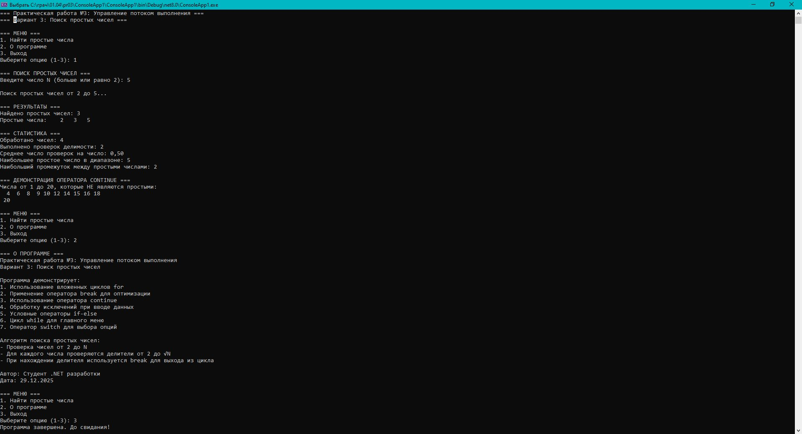

# Практическая работа 3. Управление потоком выполнения в .NET.
## Вариант 3: «Поиск простых чисел»
**Задание:** Задание: Напишите программу, которая:

Запрашивает у пользователя число N.
Используйте вложенный цикл for, находите и выводит все простые числа в отдельности от 2 до N.
Используйте оператора breakдля оптимизации проверки простоты (если делитель найден, число не простое).

### Код решения (Program.cs)

```csharp
using System;
using System.Collections.Generic;

namespace FlowControlPractice
{
    class Program
    {
        static void Main(string[] args)
        {
            Console.WriteLine("=== Практическая работа №3: Управление потоком выполнения ===");
            Console.WriteLine("=== Вариант 3: Поиск простых чисел ===");

            bool exitProgram = false;

            while (!exitProgram)
            {
                try
                {
                    Console.WriteLine("\n=== МЕНЮ ===");
                    Console.WriteLine("1. Найти простые числа");
                    Console.WriteLine("2. О программе");
                    Console.WriteLine("3. Выход");
                    Console.Write("Выберите опцию (1-3): ");

                    string choice = Console.ReadLine();

                    switch (choice)
                    {
                        case "1":
                            FindPrimeNumbers();
                            break;
                        case "2":
                            ShowAbout();
                            break;
                        case "3":
                            exitProgram = true;
                            Console.WriteLine("Программа завершена. До свидания!");
                            break;
                        default:
                            Console.WriteLine("Ошибка: Пожалуйста, выберите опцию от 1 до 3.");
                            break;
                    }
                }
                catch (Exception ex)
                {
                    Console.WriteLine($"Произошла ошибка: {ex.Message}");
                    Console.WriteLine("Попробуйте еще раз.");
                }
            }

            Console.WriteLine("\nНажмите любую клавишу для выхода...");
            Console.ReadKey();
        }

        /// <summary>
        /// Метод для поиска и вывода простых чисел от 2 до N
        /// Демонстрирует использование вложенных циклов и оператора break
        /// </summary>
        static void FindPrimeNumbers()
        {
            try
            {
                Console.WriteLine("\n=== ПОИСК ПРОСТЫХ ЧИСЕЛ ===");
                Console.Write("Введите число N (больше или равно 2): ");

                string input = Console.ReadLine();

                // Проверка ввода с помощью int.TryParse
                if (!int.TryParse(input, out int n))
                {
                    Console.WriteLine("Ошибка: Введено некорректное число.");
                    return;
                }

                // Проверка, что N >= 2
                if (n < 2)
                {
                    Console.WriteLine("Ошибка: Число N должно быть не меньше 2.");
                    return;
                }

                Console.WriteLine($"\nПоиск простых чисел от 2 до {n}...");

                // Список для хранения найденных простых чисел
                List<int> primeNumbers = new List<int>();

                int totalChecks = 0; // Счетчик проверок делимости
                int numbersProcessed = 0; // Счетчик обработанных чисел

                // ВНЕШНИЙ ЦИКЛ: перебор всех чисел от 2 до N
                for (int number = 2; number <= n; number++)
                {
                    numbersProcessed++;
                    bool isPrime = true;

                    // ВНУТРЕННИЙ ЦИКЛ: проверка делимости числа
                    // Оптимизация: проверяем делители только до квадратного корня из числа
                    int limit = (int)Math.Sqrt(number);

                    for (int divisor = 2; divisor <= limit; divisor++)
                    {
                        totalChecks++;

                        // Проверка делимости
                        if (number % divisor == 0)
                        {
                            isPrime = false;

                            // Использование оператора BREAK для оптимизации
                            // Если найден делитель, дальше проверять бессмысленно
                            break;
                        }
                    }

                    // Если число простое, добавляем его в список
                    if (isPrime)
                    {
                        primeNumbers.Add(number);
                    }
                }

                // Вывод результатов
                Console.WriteLine("\n=== РЕЗУЛЬТАТЫ ===");

                if (primeNumbers.Count > 0)
                {
                    Console.WriteLine($"Найдено простых чисел: {primeNumbers.Count}");
                    Console.Write("Простые числа: ");

                    // Вывод простых чисел с форматированием
                    int numbersPerLine = 10;
                    for (int i = 0; i < primeNumbers.Count; i++)
                    {
                        Console.Write($"{primeNumbers[i],4}");

                        // Переход на новую строку после каждого numbersPerLine чисел
                        if ((i + 1) % numbersPerLine == 0 && i != primeNumbers.Count - 1)
                        {
                            Console.WriteLine();
                            Console.Write("                  ");
                        }
                    }
                    Console.WriteLine();

                    // Статистика
                    Console.WriteLine("\n=== СТАТИСТИКА ===");
                    Console.WriteLine($"Обработано чисел: {numbersProcessed}");
                    Console.WriteLine($"Выполнено проверок делимости: {totalChecks}");
                    Console.WriteLine($"Среднее число проверок на число: {(double)totalChecks / numbersProcessed:F2}");

                    // Дополнительная информация о найденных простых числах
                    if (primeNumbers.Count >= 2)
                    {
                        int largestPrime = primeNumbers[primeNumbers.Count - 1];
                        int largestGap = 0;

                        for (int i = 1; i < primeNumbers.Count; i++)
                        {
                            int gap = primeNumbers[i] - primeNumbers[i - 1];
                            if (gap > largestGap)
                            {
                                largestGap = gap;
                            }
                        }

                        Console.WriteLine($"Наибольшее простое число в диапазоне: {largestPrime}");
                        Console.WriteLine($"Наибольший промежуток между простыми числами: {largestGap}");
                    }
                }
                else
                {
                    Console.WriteLine("Простых чисел не найдено.");
                }

                // Демонстрация работы оператора CONTINUE
                Console.WriteLine("\n=== ДЕМОНСТРАЦИЯ ОПЕРАТОРА CONTINUE ===");
                Console.WriteLine("Числа от 1 до 20, которые НЕ являются простыми:");
                int count = 0;

                for (int i = 1; i <= 20; i++)
                {
                    // Пропускаем числа меньше 2
                    if (i < 2)
                    {
                        continue; // Использование оператора CONTINUE
                    }

                    bool isNotPrime = false;

                    // Быстрая проверка на простоту (только для демонстрации)
                    for (int j = 2; j <= Math.Sqrt(i); j++)
                    {
                        if (i % j == 0)
                        {
                            isNotPrime = true;
                            break;
                        }
                    }

                    // Если число не простое, выводим его
                    if (isNotPrime)
                    {
                        Console.Write($"{i,3}");
                        count++;

                        if (count % 10 == 0)
                        {
                            Console.WriteLine();
                        }
                    }
                }
                Console.WriteLine();
            }
            catch (FormatException)
            {
                Console.WriteLine("Ошибка: Некорректный формат ввода.");
            }
            catch (OverflowException)
            {
                Console.WriteLine("Ошибка: Введено слишком большое число.");
            }
            catch (Exception ex)
            {
                Console.WriteLine($"Неожиданная ошибка: {ex.Message}");
            }
        }

        /// <summary>
        /// Метод для вывода информации о программе
        /// </summary>
        static void ShowAbout()
        {
            Console.WriteLine("\n=== О ПРОГРАММЕ ===");
            Console.WriteLine("Практическая работа №3: Управление потоком выполнения");
            Console.WriteLine("Вариант 3: Поиск простых чисел");
            Console.WriteLine("\nПрограмма демонстрирует:");
            Console.WriteLine("1. Использование вложенных циклов for");
            Console.WriteLine("2. Применение оператора break для оптимизации");
            Console.WriteLine("3. Использование оператора continue");
            Console.WriteLine("4. Обработку исключений при вводе данных");
            Console.WriteLine("5. Условные операторы if-else");
            Console.WriteLine("6. Цикл while для главного меню");
            Console.WriteLine("7. Оператор switch для выбора опций");
            Console.WriteLine("\nАлгоритм поиска простых чисел:");
            Console.WriteLine("- Проверка чисел от 2 до N");
            Console.WriteLine("- Для каждого числа проверяются делители от 2 до √N");
            Console.WriteLine("- При нахождении делителя используется break для выхода из цикла");
            Console.WriteLine("\nАвтор: Студент .NET разработки");
            Console.WriteLine("Дата: " + DateTime.Now.ToString("dd.MM.yyyy"));
        }
    }
}

```
