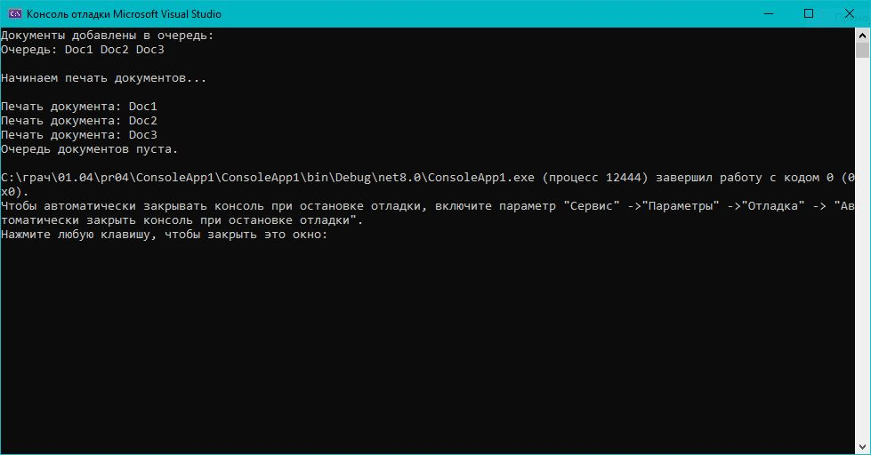

# Практическая работа 4. Реализация и применение структур данных в .NET.
## Вариант 3: «Очередь сообщений»
Задача: Создать очередь печати документов. Добавляйте документы в свою очередь и печатайте по одному.
Пример: Добавить "Doc1", "Doc2", "Doc3" → напечатать порядку

### Код решения (Program.cs)

```csharp
using System;
using System.Collections.Generic;
using System;

public class MyQueue<T>
{
    private T[] _items;
    private int _front;
    private int _rear;
    private int _size;
    private int _capacity;

    public MyQueue(int capacity = 10)
    {
        _capacity = capacity;
        _items = new T[_capacity];
        _front = 0;
        _rear = -1;
        _size = 0;
    }

    // Добавление элемента в очередь
    public void Enqueue(T item)
    {
        if (_size == _capacity)
        {
            Resize();
        }
        _rear = (_rear + 1) % _capacity;
        _items[_rear] = item;
        _size++;
    }

    // Удаление элемента из очереди
    public T Dequeue()
    {
        if (_size == 0)
            throw new InvalidOperationException("Очередь пуста");
        T result = _items[_front];
        _front = (_front + 1) % _capacity;
        _size--;
        return result;
    }

    // Просмотр первого элемента
    public T Peek()
    {
        if (_size == 0)
            throw new InvalidOperationException("Очередь пуста");
        return _items[_front];
    }

    // Вывод всех элементов
    public void PrintAll()
    {
        Console.Write("Очередь: ");
        for (int i = 0; i < _size; i++)
        {
            int index = (_front + i) % _capacity;
            Console.Write($"{_items[index]} ");
        }
        Console.WriteLine();
    }

    // Проверка наличия элемента
    public bool Contains(T item)
    {
        for (int i = 0; i < _size; i++)
        {
            int index = (_front + i) % _capacity;
            if (Equals(_items[index], item))
                return true;
        }
        return false;
    }

    private void Resize()
    {
        int newCapacity = _capacity * 2;
        T[] newItems = new T[newCapacity];
        for (int i = 0; i < _size; i++)
        {
            newItems[i] = _items[(_front + i) % _capacity];
        }
        _items = newItems;
        _capacity = newCapacity;
        _front = 0;
        _rear = _size - 1;
    }
}
class Program
{
    static void Main()
    {
        // Создаем очередь печати
        MyQueue<string> printQueue = new MyQueue<string>();

        // Добавляем документы
        printQueue.Enqueue("Doc1");
        printQueue.Enqueue("Doc2");
        printQueue.Enqueue("Doc3");

        Console.WriteLine("Документы добавлены в очередь:");

        printQueue.PrintAll();

        Console.WriteLine("\nНачинаем печать документов...\n");

        // Печатаем документы по очереди
        while (true)
        {
            try
            {
                string currentDoc = printQueue.Dequeue();
                Console.WriteLine($"Печать документа: {currentDoc}");
            }
            catch (InvalidOperationException)
            {
                Console.WriteLine("Очередь документов пуста.");
                break;
            }
        }
    }
}
```
