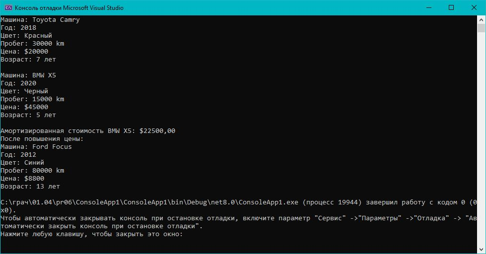

# Практическая работа 6. Создание классов и объектов на C#.
## Вариант 3: Класс «Автомобиль»

**Задание:** Создать класс Car, представляющий автомобиль. Должен поддерживать марку, модель, год выпуска, цвет, пробег, цену. Реализовать методы изменения пробега, расчета амортизации и изменения цен.
### Код решения (Program.cs)

```csharp
// See httusing System;

namespace CurrencyConverter
{
    class Program
    {
        static void Main(string[] args)
        {
            const double usdToEurRate = 0.85;

            Console.WriteLine("=== КОНВЕРТЕР ВАЛЮТ USD -> EUR ===");
            Console.WriteLine($"Текущий курс: 1 USD = {usdToEurRate} EUR");
            Console.WriteLine();

            Console.Write("Введите сумму в USD: ");

            if (double.TryParse(Console.ReadLine(), out double usdAmount))
            {
                if (usdAmount >= 0)
                {
                    double eurAmount = usdAmount * usdToEurRate;
                    Console.WriteLine($"\nРезультат конвертации:");
                    Console.WriteLine($"{usdAmount:F2} USD = {eurAmount:F2} EUR");
                }
                else
                {
                    Console.WriteLine("\nОшибка: Сумма не может быть отрицательной!");
                }
            }
            else
            {
                Console.WriteLine("\nОшибка: Введите корректное число!");
            }

            Console.WriteLine("\nДля выхода нажмите любую клавишу...");
            Console.ReadKey();
        }
    }
}
```
