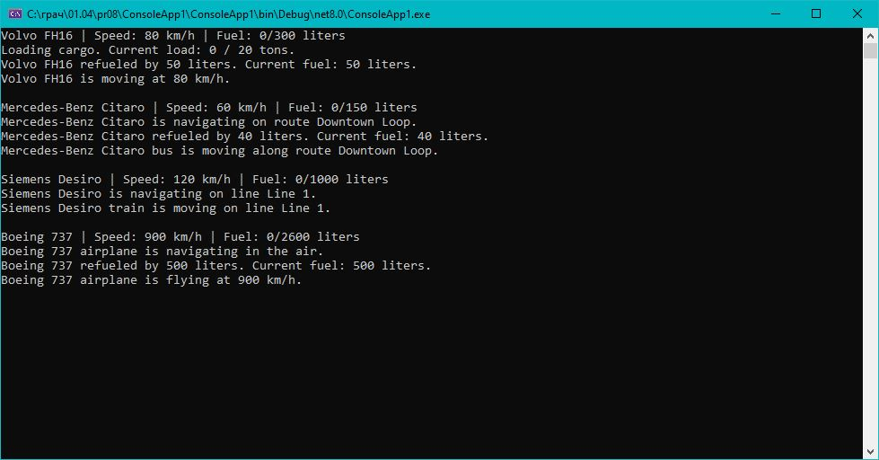

# Практическая работа 8. Создание интерфейсов и абстрактных классов в C#.
## Вариант 3: Транспортная система

**Задание:** Задача: Создать систему для управления различными типами документов с использованием интерфейсов и абстрактных классов.

### Код решения (Program.cs)

```csharp
using System;

// Интерфейсы
interface IMovable
{
    void Move();
}

interface ILoadable
{
    void LoadCargo();
    void UnloadCargo();
}

interface INavigable
{
    void Navigate();
}

interface IFuelable
{
    void Refuel(double amount);
}

// Абстрактный класс Vehicle
abstract class Vehicle
{
    public string Brand { get; set; }
    public string Model { get; set; }
    public double Speed { get; set; }
    public double FuelLevel { get; protected set; }
    public double FuelCapacity { get; set; }

    public Vehicle(string brand, string model, double speed, double fuelCapacity)
    {
        Brand = brand;
        Model = model;
        Speed = speed;
        FuelCapacity = fuelCapacity;
        FuelLevel = 0; // Начинаем с пустым баком
    }

    public virtual void DisplayInfo()
    {
        Console.WriteLine($"{Brand} {Model} | Speed: {Speed} km/h | Fuel: {FuelLevel}/{FuelCapacity} liters");
    }
}

// Конкретные классы

class Truck : Vehicle, IMovable, ILoadable, IFuelable
{
    public double CargoCapacity { get; private set; }
    public double CargoLoad { get; private set; }

    public Truck(string brand, string model, double speed, double fuelCapacity, double cargoCapacity)
        : base(brand, model, speed, fuelCapacity)
    {
        CargoCapacity = cargoCapacity;
        CargoLoad = 0;
    }

    public void Move()
    {
        Console.WriteLine($"{Brand} {Model} is moving at {Speed} km/h.");
    }

    public void LoadCargo()
    {
        Console.WriteLine($"Loading cargo. Current load: {CargoLoad} / {CargoCapacity} tons.");
        // Можно добавить логику увеличения груза
    }

    public void UnloadCargo()
    {
        Console.WriteLine($"Unloading cargo. Current load: {CargoLoad} tons.");
        // Можно сбросить груз
    }

    public void Refuel(double amount)
    {
        if (amount < 0) return;
        FuelLevel += amount;
        if (FuelLevel > FuelCapacity)
            FuelLevel = FuelCapacity;
        Console.WriteLine($"{Brand} {Model} refueled by {amount} liters. Current fuel: {FuelLevel} liters.");
    }
}

class Bus : Vehicle, IMovable, INavigable, IFuelable
{
    public string Route { get; set; }

    public Bus(string brand, string model, double speed, double fuelCapacity, string route)
        : base(brand, model, speed, fuelCapacity)
    {
        Route = route;
    }

    public void Move()
    {
        Console.WriteLine($"{Brand} {Model} bus is moving along route {Route}.");
    }

    public void Navigate()
    {
        Console.WriteLine($"{Brand} {Model} is navigating on route {Route}.");
    }

    public void Refuel(double amount)
    {
        if (amount < 0) return;
        FuelLevel += amount;
        if (FuelLevel > FuelCapacity)
            FuelLevel = FuelCapacity;
        Console.WriteLine($"{Brand} {Model} refueled by {amount} liters. Current fuel: {FuelLevel} liters.");
    }
}

class Train : Vehicle, IMovable, INavigable
{
    public string Line { get; set; }

    public Train(string brand, string model, double speed, double fuelCapacity, string line)
        : base(brand, model, speed, fuelCapacity)
    {
        Line = line;
    }

    public void Move()
    {
        Console.WriteLine($"{Brand} {Model} train is moving on line {Line}.");
    }

    public void Navigate()
    {
        Console.WriteLine($"{Brand} {Model} is navigating on line {Line}.");
    }
}

class Airplane : Vehicle, IMovable, INavigable, IFuelable
{
    public int PassengerCount { get; set; }

    public Airplane(string brand, string model, double speed, double fuelCapacity, int passengerCount)
        : base(brand, model, speed, fuelCapacity)
    {
        PassengerCount = passengerCount;
    }

    public void Move()
    {
        Console.WriteLine($"{Brand} {Model} airplane is flying at {Speed} km/h.");
    }

    public void Navigate()
    {
        Console.WriteLine($"{Brand} {Model} airplane is navigating in the air.");
    }

    public void Refuel(double amount)
    {
        if (amount < 0) return;
        FuelLevel += amount;
        if (FuelLevel > FuelCapacity)
            FuelLevel = FuelCapacity;
        Console.WriteLine($"{Brand} {Model} refueled by {amount} liters. Current fuel: {FuelLevel} liters.");
    }
}

// Основная программа
class Program
{
    static void Main()
    {
        // Создаем экземпляры
        Truck truck = new Truck("Volvo", "FH16", 80, 300, 20);
        Bus bus = new Bus("Mercedes-Benz", "Citaro", 60, 150, "Downtown Loop");
        Train train = new Train("Siemens", "Desiro", 120, 1000, "Line 1");
        Airplane plane = new Airplane("Boeing", "737", 900, 2600, 189);

        // Работа с грузовиком
        truck.DisplayInfo();
        truck.LoadCargo();
        truck.Refuel(50);
        truck.Move();

        Console.WriteLine();

        // Работа с автобусом
        bus.DisplayInfo();
        bus.Navigate();
        bus.Refuel(40);
        bus.Move();

        Console.WriteLine();

        // Работа с поездом
        train.DisplayInfo();
        train.Navigate();
        train.Move();

        Console.WriteLine();

        // Работа с самолетом
        plane.DisplayInfo();
        plane.Navigate();
        plane.Refuel(500);
        plane.Move();

        Console.ReadLine();
    }
}
```
