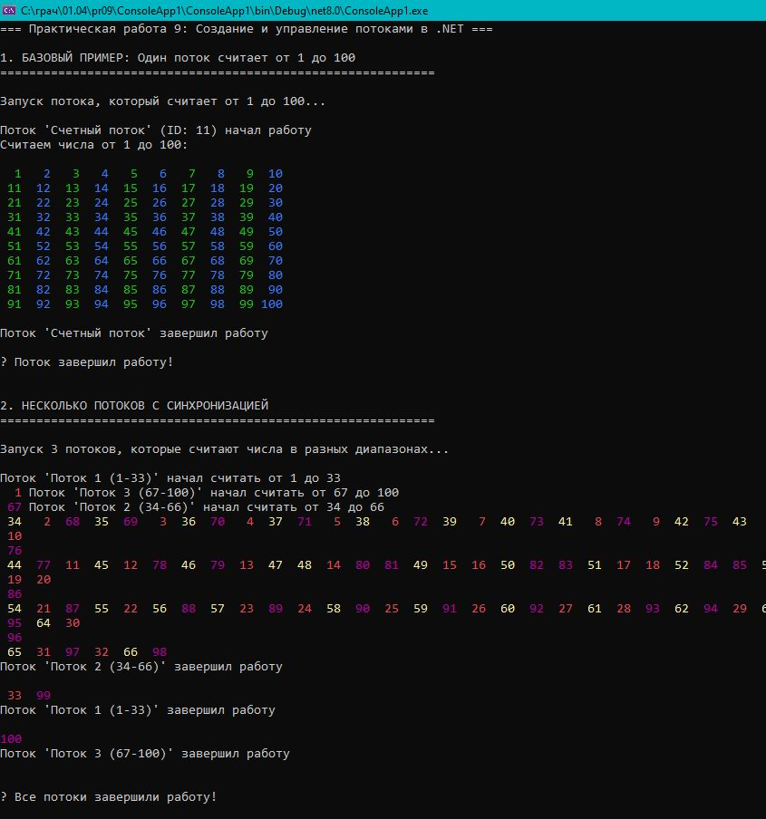

# Практическая работа 9. Создание и управление потоками в .NET.
## Создать поток, который считает числа от 1 до 100.

Цель близ
Научиться создавать и запускать потоки на C#.
Освоить методы управления потоками (приостановка, возобновление, завершение).
Изучить синхронизацию потоков для предотвращения возникновения проблем при доступе к общим ресурсам.

### Код решения (Program.cs)

```csharp
using System;
using System.Threading;
using System.Collections.Generic;
using System.Linq;
using System.Diagnostics;

namespace ThreadPractice
{
    class Program
    {
        // Объект для синхронизации вывода в консоль
        private static readonly object consoleLock = new object();

        // Объект для синхронизации доступа к общим данным
        private static readonly object dataLock = new object();

        // Общие данные для потоков
        private static int sharedCounter = 0;
        private static List<int> allNumbers = new List<int>();
        private static bool isRunning = true;

        static void Main(string[] args)
        {
            Console.WriteLine("=== Практическая работа 9: Создание и управление потоками в .NET ===\n");

            try
            {
                // 1. БАЗОВЫЙ ПРИМЕР: Один поток считает от 1 до 100
                Console.WriteLine("1. БАЗОВЫЙ ПРИМЕР: Один поток считает от 1 до 100");
                Console.WriteLine(new string('=', 60));

                BasicThreadExample();
                Thread.Sleep(1000); // Небольшая пауза между примерами

                // 2. НЕСКОЛЬКО ПОТОКОВ С СИНХРОНИЗАЦИЕЙ
                Console.WriteLine("\n\n2. НЕСКОЛЬКО ПОТОКОВ С СИНХРОНИЗАЦИЕЙ");
                Console.WriteLine(new string('=', 60));

                MultipleThreadsWithSynchronization();
                Thread.Sleep(1000);

                // 3. РАБОТА С ОБЩИМИ ДАННЫМИ
                Console.WriteLine("\n\n3. РАБОТА С ОБЩИМИ ДАННЫМИ");
                Console.WriteLine(new string('=', 60));

                SharedDataExample();
                Thread.Sleep(1000);

                // 4. УПРАВЛЕНИЕ ПОТОКАМИ
                Console.WriteLine("\n\n4. УПРАВЛЕНИЕ ПОТОКАМИ (ПРИОСТАНОВКА, ВОЗОБНОВЛЕНИЕ)");
                Console.WriteLine(new string('=', 60));

                ThreadManagementExample();
                Thread.Sleep(1000);

                // 5. POOL ПОТОКОВ
                Console.WriteLine("\n\n5. POOL ПОТОКОВ");
                Console.WriteLine(new string('=', 60));

                ThreadPoolExample();
                Thread.Sleep(1000);

                // 6. СРАВНЕНИЕ ПРОИЗВОДИТЕЛЬНОСТИ
                Console.WriteLine("\n\n6. СРАВНЕНИЕ ПРОИЗВОДИТЕЛЬНОСТИ");
                Console.WriteLine(new string('=', 60));

                PerformanceComparison();
            }
            catch (Exception ex)
            {
                Console.WriteLine($"\n❌ Ошибка: {ex.Message}");
            }
            finally
            {
                Console.WriteLine("\n" + new string('=', 60));
                Console.WriteLine("Программа завершена. Нажмите любую клавишу для выхода...");
                Console.ReadKey();
            }
        }

        /// <summary>
        /// 1. Базовый пример: один поток считает от 1 до 100
        /// </summary>
        static void BasicThreadExample()
        {
            Console.WriteLine("\nЗапуск потока, который считает от 1 до 100...\n");

            // Создаем новый поток
            Thread countingThread = new Thread(CountNumbers)
            {
                Name = "Счетный поток" // Устанавливаем имя потока
            };

            // Запускаем поток
            countingThread.Start();

            // Ждем завершения потока
            countingThread.Join();

            Console.WriteLine("\n✅ Поток завершил работу!");
        }

        /// <summary>
        /// Метод, который выполняется в потоке - считает числа от 1 до 100
        /// </summary>
```
