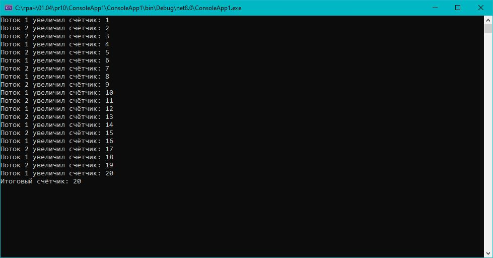

# Практическая работа 10. Синхронизация потоков (lock, Monitor, Mutex)

## Вариант 3: Используйте Mutexдля увеличения счётчика в 2 потоках.


### Код решения (Program.cs)

```csharp
using System;
using System.Threading;

class Program
{
    static int counter = 0;
    static Mutex mutex = new Mutex();

    static void IncreaseCounter()
    {
        for (int i = 0; i < 10; i++)
        {
            // Захват мьютекса
            mutex.WaitOne();
            try
            {
                counter++;
                Console.WriteLine($"{Thread.CurrentThread.Name} увеличил счётчик: {counter}");
            }
            finally
            {
                // Освобождение мьютекса
                mutex.ReleaseMutex();
            }
            Thread.Sleep(100); // задержка для наглядности
        }
    }

    static void Main()
    {
        Thread t1 = new Thread(IncreaseCounter) { Name = "Поток 1" };
        Thread t2 = new Thread(IncreaseCounter) { Name = "Поток 2" };

        t1.Start();
        t2.Start();

        t1.Join();
        t2.Join();

        Console.WriteLine($"Итоговый счётчик: {counter}");
        Console.ReadLine(); // чтобы окно не закрывалось сразу
    }
}
```
